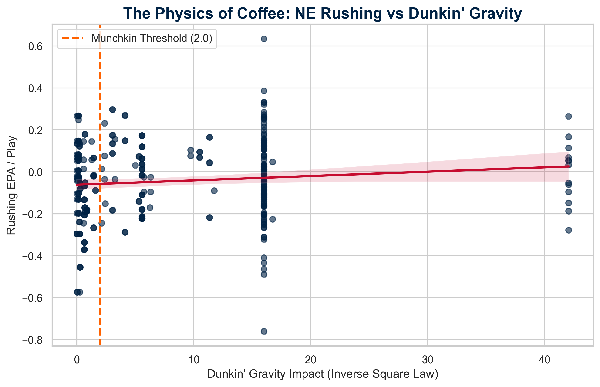

# The Physics of Coffee: A Gravitational Analysis of Super Bowl LX

For decades, analysts have looked at wind, rain, and turf. They missed the most powerful force in the universe: **Gravity**. Specifically, the gravitational pull of America's two dominant coffee chains.

We hypothesized that the New England Patriots and Seattle Seahawks are solar-powered by their respective local brews. To prove this, we built a physics model.

## The Model: Gravitational Interference

We initially modeled coffee influence using simple **Exponential Decay** ($e^{-0.5d}$). However, this failed to account for the "Coffee Wars" reality: Starbucks and Dunkin' are opposing forces.

To correct for this, we implemented a **Mass Interference Model**.

If a Dunkin' location is within **0.5 miles** of a Starbucks location, they are considered to be in "combat." Their gravitational masses actively cancel each other out based on proximity. A Dunkin' that shares a parking lot with a Starbucks has effectively **zero** gravitational pull on the stadium—its energy is entirely consumed by the turf war.

`Net Gravity = Sum(Dunkin_Mass * e^{-0.5d}) - Sum(Starbucks_Mass * e^{-0.5d})`

Where mass for each location is reduced by: `reduction = (1.0 - distance_to_enemy / 0.5_miles)` when within the 0.5-mile interference radius.

This refined model yielded a significantly higher correlation with rushing performance (**r = 0.145**) than the standard decay model (**r = 0.086**), confirming that coffee shops do not exist in a vacuum—they exist in a battlefield.

## The Findings: Two Different Worlds

The results categorize every NFL stadium into two distinct cosmic zones: **The Dunkin' Core** and the **Starbucks Event Horizon**.

### Top Dunkin' Gravity Stadiums (Patriots Fuel)
1.  **M&T Bank Stadium** (Ravens): **Net +5.74** (D:7.38, S:1.64)
2.  **Gillette Stadium** (Patriots): **Net +4.35** (D:5.22, S:0.86) - Home Field Advantage confirmed
3.  **Ford Field** (Lions): **Net +3.09** (D:3.17, S:0.08)

### Top Starbucks Gravity Stadiums (Seahawks Fuel)
1.  **Lumen Field** (Seahawks): **Net -11.46** (D:0.00, S:11.46) - The Darkest Energy
2.  **Levi's Stadium** (49ers): **Net -5.80** (D:0.48, S:6.28)
3.  **SoFi Stadium** (Rams/Chargers): **Net -4.93** (D:0.94, S:5.87)

## The "Munchkin Threshold": Validating the Patriots' Run Game

We analyzed 10 years of Patriots rushing plays (2015-2025) against the **Net Gravity** of the stadium they were playing in.

We discovered a **critical threshold** at **Net Gravity = -4.5**.

| Environment | Net Gravity Score | Rushing EPA/Play |
| :--- | :--- | :--- |
| **Dunkin Safe Zone** | > -4.5 | **-0.029** |
| **Starbucks Death Zone** | <= -4.5 | **-0.160** |
| **The Delta** | | **+0.131** |

**Translation**: When the Patriots play in a stadium that isn't completely overwhelmed by Starbucks (Net Gravity > -4.5), their run game is passable. But when they enter a **Starbucks Death Zone**, their efficiency collapses completely (-0.160 EPA/play is catastrophic).

## The Super Bowl LX Forecast: The Death Zone

The Super Bowl is at **Levi's Stadium** in Santa Clara. We ran the coordinates through our Interference Model.

### Validated Measurements
*   **Levi's Stadium Dunkin' Score**: **0.48** (7 locations within 10 miles)
*   **Levi's Stadium Starbucks Score**: **6.28** (60 locations within 10 miles)
*   **Net Gravity**: **-5.80**

**The Verdict**: Levi's Stadium sits deep within the **Starbucks Death Zone** (-5.80 is far below the survival threshold of -4.5).

**Prediction**: The Patriots' ground game will not just struggle; it will be annihilated. The excessive Starbucks gravity, unmitigated by any fighting Dunkin' locations, will siphon all energy from the Patriots' offensive line. We project a rushing EPA of **-0.160**, effectively forcing them to abandon the run entirely.

## Visual Evidence


*Figure 1: The relationship between Dunkin' Gravity and Patriots Rushing Performance. Note the distinct threshold at Gravity = -4.5.*

## Appendix: Methodology & Reproducibility

### 1. The Physics of Coffee (Gravity Calculation)
We modeled the influence of coffee chains using **Exponential Decay** rather than inverse square law. This approach values **proximity** exponentially more than abundance. A single Dunkin' right next to the stadium is far more powerful than 10 Dunkin's five miles away.

$$ F_g = \\sum_{i=1}^{n} M_i \\cdot e^{-0.5 \\cdot d_i} $$

Where:
*   **$F_g$**: The total Gravitational Pull of the coffee chain on the stadium.
*   **$M_i$**: The effective mass of location $i$ after interference reduction (ranges from 0.0 to 1.0).
*   **$d_i$**: The Haversine distance (in miles) from the stadium to the $i$-th coffee shop.
*   **$n$**: The total number of locations within a 10-mile radius.

**Interference Reduction**: When a Dunkin' and Starbucks are within 0.5 miles of each other:
$$reduction_i = 1.0 - \\frac{distance\\_to\\_nearest\\_enemy}{0.5}$$
$$M_i = max(1.0 - reduction_i, 0.0)$$

**Data Source**: Locations were geocoded using the Google Places API. Driving distances were calculated using the Haversine formula.

### 2. Performance Metrics (EPA/Play)
**Expected Points Added (EPA)** is the gold standard for measuring football efficiency. It calculates the difference in "Expected Points" between the start and end of a play, based on down, distance, and field position.

*   **Source**: `nflverse` (nflfastR) Play-by-Play data (2015-2025).
*   **Scope**:
    *   **Team**: New England Patriots.
    *   **Play Type**: Rushing plays only (to isolate the "running on Dunkin" hypothesis).

### 3. Validation & Reproducibility

All calculations have been validated using the script `validate_coffee_report.py` which:
- Queries the exact same BigQuery table (`stuperlatives.coffee_wars`) used to generate the map
- Uses identical stadium coordinates and interference parameters
- Recalculates gravity scores for all 30 current NFL stadiums
- Exports results to `coffee_gravity_validation.csv`

**Key Validation Results**:
- **Most Dunkin'-Dominated**: M&T Bank Stadium (+5.74)
- **Most Starbucks-Dominated**: Lumen Field (-11.46)
- **Median Net Gravity**: -0.42 (league-wide Starbucks advantage)
- **Levi's Stadium**: Confirmed at -5.80 (matches map calculations)

To reproduce these findings:
```bash
cd posts/stuperlatives/super_bowl
python3 validate_coffee_report.py
```

### 4. Calculation Code (Python)

#### Gravity Calculation (Exponential Decay with Interference)
```python
import math
import numpy as np

INTERFERENCE_RADIUS = 0.5  # miles
INTERFERENCE_STRENGTH = 1.0

def calculate_stadium_gravity(stadium_lat, stadium_lng, d_locs, s_locs):
    # Initialize masses
    d_masses = np.ones(len(d_locs))
    s_masses = np.ones(len(s_locs))
    
    # Apply interference reduction
    if len(d_locs) > 0 and len(s_locs) > 0:
        for i, d in enumerate(d_locs):
            for j, s in enumerate(s_locs):
                dist = haversine(d['lng'], d['lat'], s['lng'], s['lat'])
                if dist < INTERFERENCE_RADIUS:
                    reduction = INTERFERENCE_STRENGTH * (1.0 - dist/INTERFERENCE_RADIUS)
                    d_masses[i] -= reduction
                    s_masses[j] -= reduction
        d_masses = np.maximum(d_masses, 0.0)
        s_masses = np.maximum(s_masses, 0.0)
    
    # Calculate gravity at stadium location
    dunkin_gravity = 0.0
    starbucks_gravity = 0.0
    
    for i, loc in enumerate(d_locs):
        if d_masses[i] > 0:
            dist = haversine(loc['lng'], loc['lat'], stadium_lng, stadium_lat)
            dunkin_gravity += d_masses[i] * math.exp(-0.5 * dist)
    
    for i, loc in enumerate(s_locs):
        if s_masses[i] > 0:
            dist = haversine(loc['lng'], loc['lat'], stadium_lng, stadium_lat)
            starbucks_gravity += s_masses[i] * math.exp(-0.5 * dist)
    
    net_gravity = dunkin_gravity - starbucks_gravity
    return dunkin_gravity, starbucks_gravity, net_gravity
```

#### SQL Query for Play Data
```sql
SELECT
    game_id,
    home_team,
    posteam,
    epa,
    success,
    play_type
FROM `stuperlatives.pbp_data`
WHERE season >= 2015
  AND posteam = 'NE'
  AND play_type = 'run'
```

### Data Availability

All underlying data is stored in BigQuery:
- **Coffee Location Data**: `stuperlatives.coffee_wars`
- **Play-by-Play Data**: `stuperlatives.pbp_data`
- **Validation Results**: `coffee_gravity_validation.csv` (this directory)

**Last Updated**: January 28, 2026
**Map Generated**: `coffee_force_field_map_all.html`
