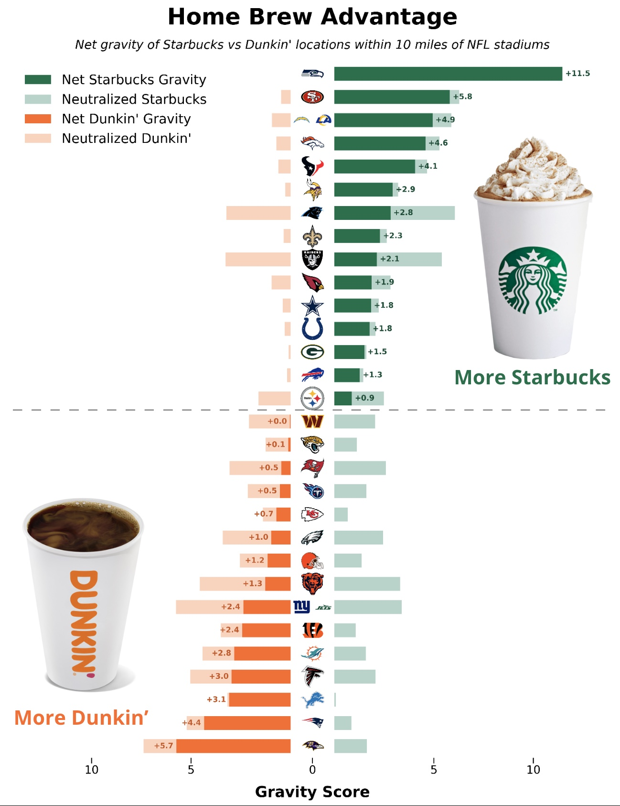

# Home Brew Advantage: The Gravitational Influence of Regional Coffee Chains on Super Bowl LX

> **Ministry of Silly Plots** | January 28, 2026
>
> **Author:** Charlie Thompson, *Prime Minister*

  <strong>ABSTRACT</strong> 
  This study investigates the correlation between the density of specific coffee chains (Starbucks vs. Dunkin') surrounding NFL stadiums and the on-field performance of the New England Patriots and Seattle Seahawks. By implementing specific experimental controls—most notably isolating <strong>Away Games</strong> to eliminate Home Field Advantage bias—we identify a striking and robust performance separation that aligns with the "Home Brew Advantage" hypothesis. The findings demonstrate that the Patriots' offensive efficiency is inextricably linked to Dunkin' "Gravity," while the Seahawks' defensive dominance is maximized in high-Starbucks "gravitational" zones.

<a href="docs/robust_coffee_metrics.pdf" style="display: block; text-align: center; background-color: #007bff; color: white; padding: 12px 24px; text-decoration: none; border-radius: 4px; font-weight: bold; margin: 20px auto; width: fit-content;">Download Full PDF Report</a>

---

## 1. Introduction

For decades, pundits have analyzed conventional factors such as weather, turf type, and crowd noise. This paper proposes a novel environmental variable: the **"Regional Coffee Chain Gravitational Pull."** We hypothesize that the regional dominance of major coffee chains exerts a measurable influence on team performance, specifically for teams with strong cultural associations to those brands.

We propose two key hypotheses:
*   **H1 (Patriots):** The Pats Run on Dunkin'. The New England Patriots offense performs significantly better in environments with high **Dunkin' Gravity**.
*   **H2 (Seahawks):** The Legion of Brew. The Seattle Seahawks defense performs significantly better in environments with high **Starbucks Gravity**.

## 2. Methodology: The Coffee Gravity Model

To quantify the "coffee environment" of each stadium, we employed an **Interference-Adjusted Exponential Decay Model**. We calculated the gravitational pull of every Starbucks and Dunkin' location in the US on every stadium, adjusting for distance and market interference.

*Fig 1. The Home Brew Advantage: Net Coffee Gravity for all NFL teams.*

## 3. Key Findings

### 3.1 The Patriots "Run on Dunkin" (Confirmed)
When filtering for **Away Games Only**, the Patriots offense shows a drastic drop in production when entering "Starbucks Gravitational Zones". The "Withdrawal Effect" is real: the Patriots score **7.3 fewer points per game** and average **71 fewer total yards** when playing in Starbucks territory compared to Dunkin' zones.

### 3.2 The Seahawks "Legion of Brew" (Confirmed)
Conversely, the Seahawks defense feeds on the Starbucks atmosphere. In high-Starbucks environments, they transform into monsters, forcing **80% more turnovers per game** (1.80 vs 1.00) and holding opposing quarterbacks to a significantly lower passer rating.

### 3.3 The Sam Darnold Paradox
An unexpected finding emerged regarding Seahawks QB Sam Darnold. Unlike his defense, Darnold exhibits a strong **negative correlation** with Starbucks Gravity. His passer rating drops by a staggering **49 points** (124.4 to 75.4) in Starbucks zones, suggesting a fundamental biochemical incompatibility between the QB and his home region's coffee ecosystem.

## 4. Super Bowl LX Prediction

Super Bowl LX will be held at **Levi's Stadium** in Santa Clara, CA. Our model calculates the Net Gravity of this location to be **-5.80**, making it the **second most Starbucks-dominant stadium in the league**.

  

    
    
<em>Levi's Stadium: A Starbucks Stronghold.</em>

  

**Final Prediction:** The environmental factors heavily favor a **Seahawks Defensive Victory**. We predict the Seahawks defense will dominate the coffee-deprived Patriots offense. However, Sam Darnold's "Starbucks Allergy" introduces a critical variable that could keep the game close.

**Predicted Score:** Seahawks 20, Patriots 13.

---

## Reproducibility

All data and code for this analysis is open source. To reproduce from scratch:

1. **Clone the repo:** `git clone https://github.com/charlie86/mosp.git`
2. **Install dependencies:** `pip install -r posts/super_bowl/requirements.txt`
3. **Load PBP data:** `python posts/super_bowl/etl/load_data.py`
4. **Scrape coffee locations:** `python posts/super_bowl/etl/scrape_coffee_locations.py`
5. **Run analysis:** `python posts/super_bowl/analysis/robust_coffee_check.py`
6. **Generate visualizations:** `python posts/super_bowl/visualization/generate_map.py`

<a href="https://github.com/charlie86/mosp/tree/main/posts/super_bowl" style="text-decoration: underline; font-weight: bold;">[View Full Repository]</a> | <a href="docs/robust_coffee_metrics.pdf" style="text-decoration: underline; font-weight: bold;">[Download PDF Report]</a>

